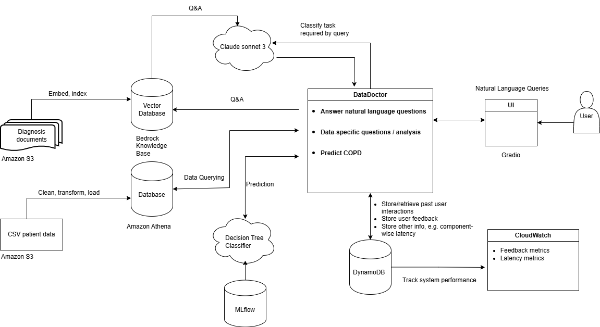
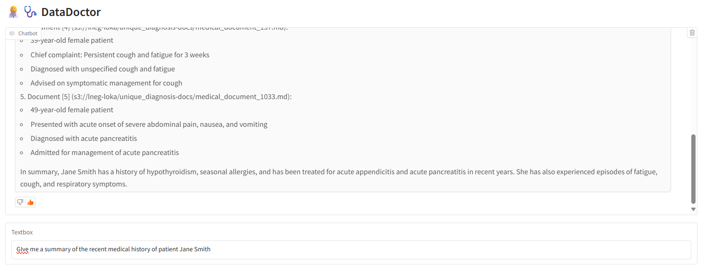

# **MedicalBot** AI AGENT

**MedicalBot** is a python agentic AI chatbot that uses `claude sonnet 3` to:
  - answer natural language questions based on patients' medical records;
  - predict patient outcomes based on input feature values;
  - retrieve and aggregate anonymized patient data.

  Launch **MedicalBot UI**:

  Create environment with dependnecies:
  
   ```poetry install --only ui --no-root```

  Run UI:
  
   ```poetry run python -m src.agent_ui.medicalbot_ui```

   **Note**: You must have an API key before using **MedicalBot**

  ## Table of Contents
  - [Repo Contents](#Repo-contents)
  - [MedicalBot current schema](#MedicalBot-current-schema)
  - [Detailed **MedicalBot** description](#detailed-MedicalBot-description)
  - [Tech-stack summary](#Tech-stack-summary)
  - [Patient outcome classification model](#Patient-outcome-classification-model)
  - [Question answering + RAG](#Question-answering-+-RAG)
  - [Data retrieval and aggregation](#Data-retrieval-and-aggregation)
  - [Using **MedicalBot**](#Using-MedicalBot)
  - [Monitoring Dashboard](#Monitoring-dashboard)
  - [Upcoming features](#Upcoming-features)

  ### Repo contents
  - `\src\agent` contains the **MedicalBot** source code.
  - `\src\agent_ui` contains the **MedicalBot** Gradio UI.
  - `\src\monitoring` defines metrics monitoring logic.
  - `\scripts` contains scripts used e.g. to train the predictive model, clean and upload data, etc.
  - `\mlflow-project` contains scripts to process data and train, track and deploy classification model
  - `\notebooks` contains jupyter notebooks used for various ends, such as exploring the dataset or testing the agent's functionalities.
  - `\resources\layers` contains necessary aws lambda layers.
  - `\resources\figures` contains schemas of the **MedicalBot**
  - `\.github\workflows` contains yml files to deploy changes to agent code automatically on merges to `main`


  ### **MedicalBot** current schema
  


  ### Detailed **MedicalBot** description

  **MedicalBot** is an agentic AI Chatbot with several features:
  - answer natural language questions about patients' medical history, leveraging a database of textual patient medical records and citing relevant sources.
  - predict patient outcomes for Chronic Obstructive Pulmonary Disease class, leveraging the `patient_data` dataset. This is achieved with a Decision Tree Classifier.
  - retrieve and aggregate anonymized medical data from the `patient_data` dataset.
  - a `Gradio` GUI for users to interact with **MedicalBot** - send queries and provide feedback on individual answers


  ### Tech-stack summary

  - **MedicalBot** source code written with python3.12
  - `Amazon Lambda` to deploy **MedicalBot**
  - `Gradio` User Interface to **MedicalBot**
  - `claude sonnet 3` foundational model to answer user queries
  - `amazon.titan-embed-text-v2:0` embedding model to embedd textual medical records for RAG
  - `Amazon Bedrock Knowlegde Base` vector database to store embeddings and metadata for RAG
  - `Amazon Athena` database to store tabular patient data for querying
  - `DynamoDB` database to store past user interactions and user feedback
  - `Amazon S3` to store dataset and medical records
  - `AWS CloudWatch` to monitor performance metrics
  - `scikit-learn` to train decision tree classifier on patient data
  - `mlflow` to track and deploy the classification model
  - `AWS Secrets Manager` for api key management.
  - `GitHub Actions` to automate deployment of changes to a **MedicalBot**


  ### Patient outcome classification model
  
  The **MedicalBot** can use a trained `Scikit-Learn` Decision Tree Classifier to predict the class of Chronic Obstructive Pulmonary Disease, based on user-provided feature values.

  ### Question answering + RAG

  The **MedicalBot** can answer natural language questions about patients' medical history based on a knowledge base of textual medical records. In this case, the **MedicalBot** includes citations and source s3 URI of relevant information sources.


  ### Data retrieval and aggregation
  The **MedicalBot** can answer data-specific questions by querying an `Amazon Athena` database with tabular patient data.
 

  ### Using **MedicalBot**
  
  The user can interact with **MedicalBot** through a `Gradio` UI. To launch the GUI, just run:

   ```python -m src.agent_ui.medicalbot_ui``
  

  A typical interaction with the **MedicalBot** will look like this:
  

  **Note**: the AWS Lambda version of **MedicalBot** cannot currently make predictions using the classifier, because no AWS Lambda doesn't support layers with cumulative size larger than ~20MB. The agent will be moved to a containerized architecture.
  
  **Note**: **MedicalBot** is protected by an API key, which you must have in order to query the agent.

  ### Monitoring Dashboard
  Positive feedback rate and task completion rate are tracked hourly in a monitoring dashboard which you can access by clicking the image below:

  [](https://luisfmsonegrao.github.io/MedicalBot/monitoring/dashboard.html)


  
  
  ### Upcoming features
  A series of features will be added to **MedicalBot** in the future:
  - enable usage of user interaction history (e.g. for context tracking)
  - enable usage of user feedback and task completion metrics for system tuning
  - enable storage and usage of other performance metrics:
    - model confidence:
        - entropy of predicted sequence
    - Implicit feedback:
        - session length/duration statistics
        - rephrasing rate
        - sentiment analysis of next queries
        - etc.

    - Latency metrics
  - implement version control of dataset


