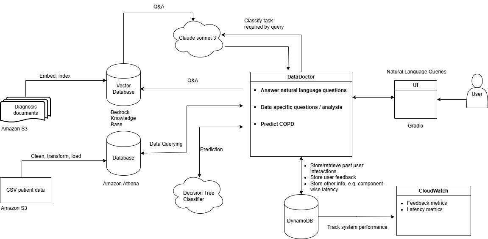

# **MedicalBot** AI AGENT

**MedicalBot** is a python agentic AI chatbot that uses `claude sonnet 3` to:
  - predict patient outcomes based on input feature values;
  - answer natural language questions based on patients' medical records;
  - retrieve and aggregate anonymized patient data.

  ## Table of Contents
  - [Repo Contents](#Repo-contents)
  - [MedicalBot current schema](#MedicalBot-current-schema)
  - [Detailed **MedicalBot** description](#detailed-MedicalBot-description)
  - [Tech-stack summary](#Tech-stack-summary)
  - [Patient outcome classification model](#Patient-outcome-classification-model)
  - [Question answering + RAG](#Question-answering-+-RAG)
  - [Data retrieval and aggregation](#Data-retrieval-and-aggregation)
  - [Using **MedicalBot**](#Using-MedicalBot)
  - [Upcoming features](#Upcoming-features)

  ### Repo contents
  - `\src` contains the **MedicalBot** agentic AI chatbot source code.
  - `\scripts` contains scripts used e.g. to train the predictive model, clean and upload data, etc.
  - `\notebooks` contains jupyter notebooks used for various ends, such as exploring the dataset or testing the agent's functionalities.
  - `\figures` contains useful figures to illustrate the project.

  ### **MedicalBot** current schema
  

  ### Detailed **MedicalBot** description

  **MedicalBot** is an agentic AI Chatbot with several features:
  - predict patient outcomes for Chronic Obstructive Pulmonary Disease class, leveraging the `patient_data` dataset. This is achieved with a Decision Tree Classifier.
  - answer natural language questions about patients' medical history, leveraging a database of textual patient medical records and citing relevant sources.
  - retrieve and aggregate anonymized medical data from the `patient_data` dataset.
  - a `Gradio` GUI allows users to interact with the agent by writing natural language queries in a text box. It allows users to provide feedback on the quality of the agent's answers via 'thumbs-up' and 'thumbs-down' buttons. This feedback is currently not processed.

  The high-level behaviour of the **MedicalBot**  is defined in the `orchestrate` function inside `orchestrator.py`. An augmented user query is first passed to the foundation model for task classification and feature extraction. Based on the foundation model's classification of the user query as a prediction task, question answering task or database query task, the **MedicalBot**  may invoke the classification model, it may query the Athena database, or it may invoke the foundation model once more for question answering.

  ### Tech-stack summary

  - **MedicalBot** source code written with python3.12
  - `claude sonnet 3` foundational model to answer user queries
  - `amazon.titan-embed-text-v2:0` embedding model to embedd textual medical records for RAG
  - `Amazon Bedrock Knowlegde Base` vector database to store embeddings and metadata for RAG
  - `Amazon Athena` database to store tabular patient data for querying
  - `Amazon Lambda` to provide entrypoint to **MedicalBot**
  - `scikit-learn` decision tree classifier for classification model
  - `Gradio` to build chat interface to **MedicalBot**
  - `Amazon S3` to store dataset and medical records

  ### Patient outcome classification model
  
  The **MedicalBot** can use a trained `Scikit-Learn` Decision Tree Classifier to predict the class of Chronic Obstructive Pulmonary disease, based on user-provided feature values.
  The Decision Tree Classifier was trained on the `patient_data` dataset, using a subset of its features to predict the class of Chronic Obstructive Pulmonary Disease for a given patient. 
  
  ANOVA, Chi-Squared and other hypothesis tests revealed that none of the features in the dataset actually have significant discriminative power in identifying the class of Chronic Obstructive Pulmonary Disease.
  As such, no further effort was made to improve the classification model, e.g. through model selection, cross-validation or hyperparameter tuning. Furthermore, only features 'age', 'sex', 'smoker' and 'bmi' were included in the model, for ease of demonstration.

  - `preprocess_patient_data.py` was used to clean, filter and transform the dataset.
  - `train_classification_model.py` was used to train the Decision Tree Classifier used by the **MedicalBot**  agent.
  - the function `orchestrate` defined in `orchestrator.py` defines **MedicalBot** 's behavior. If a user query is classified by the foundation model as a prediction task, the foundation model retrieves features and feature values from the user query. **MedicalBot** then invokes the trained classification model with these feature values.

  ### Question answering + RAG

  The **MedicalBot** can answer natural language questions about patients' medical history based on a knowledge base of textual medical records. In this case, the **MedicalBot** includes citations and source s3 URI of relevant information sources.
  The medical records were cleaned, chunked, embedded with `amazon.titan-embed-text-v2:0` and uploaded to an Amazon Bedrock Knowledge Base.

  - the medical record documents were cleaned with `clean_markdown_files.py` and `remove_duplicate_files.py`.
  - the function `orchestrate` defined in `orchestrator.py` defines **MedicalBot** 's behavior. If a user query is classified by the foundation model as a question answering task, **MedicalBot** augments the user query with relevant contextual knowledge from the database of medical records and invokes the foundation model again to get an answer. The **MedicalBot** includes citations and source URI of relevant information sources in its answers.

  ### Data retrieval and aggregation
  The **MedicalBot** can answer data-specific questions by querying an `Amazon Athena` database.
  - the function `orchestrate` defined in `orchestrator.py` defines **MedicalBot**'s behavior. If a user query is classified by the foundation model as a database querying task, the foundation model converts the user query into an equivalent SQL statement, which `DataDcotor` uses to query the `Athena` database.

  ### Using **MedicalBot**
  The user can interact with **MedicalBot** in two ways:
  - through a `Gradio` UI. The UI is defined in `MedicalBot_ui.py` and can be launched by running the script from the command line. When the user submits a query through the UI, an `AWS Lamdba` function is triggered and executes `orchestrate` from `orchestrator.py`. The answer to the user query is displayed in the `Gradio` UI. Feedback on each answer can be provided by the user through 'thumbs-up' and 'thumbs-down' buttons. This feedback is currently not processed.
  - by invoking 'orchestrate' directly, as exemplified in `test_agent_orchestrator` in `\notebooks`. This bypasses the `AWS Lambda` endpoint but still queries the Amazon Bedrock and Amazon Athana databases and prompts the foundation model through Amazon Bedrock.

  A typical interaction with the **MedicalBot** will look like this:
  

  **Note**: the AWS Lambda version of **MedicalBot** cannot currently make predictions using the classifier, because no Amazon Lambda Layer supporting python3.12 and scikit-learn is available.
  
  **Note**: If you clone this repo locally and try to run **MedicalBot** , you do not have the necessary AWS accesses, so it will not actually work.
  
  ### Upcoming features
  A series of features will be added to **MedicalBot** in the future:
  - enable storage and usage of user interaction history with **MedicalBot**
  - enable storage and usage of user feedback - for performance monitoring and tuning
  - enable storage of other performance metrics, e.g. component-wise latency
  - enable more complex data analysis tasks, e.g. plotting
  - implement version control of dataset and model
  - add regression model to predict values of alanine aminotransferases
  - Enable caching context and user history to improve latency

  With some of these additions, the **MedicalBot** application schematic will look more like this:
  
